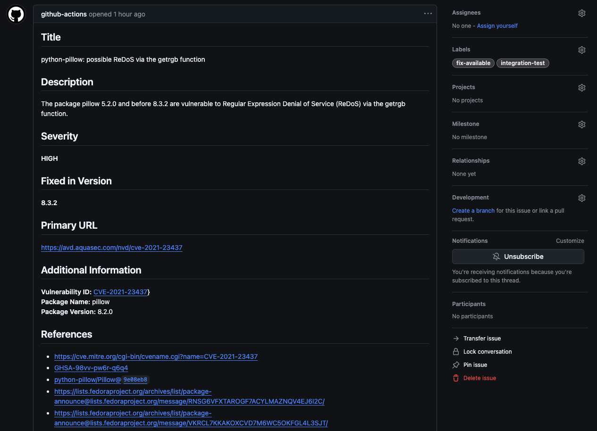

# Trissue – A legendary journey to secure your repositories!

This GitHub action reports results from a [Trivy](https://github.com/aquasecurity/trivy) vulnerability scan as GitHub issues.

Issues will be generated for each vulnerability with the ability to enable a 'fix-available' label to easily filter issues but also keep track of issues without a fix.

## Examples



## Features

- Takes any Trivy JSON output and creates a list of issues
- Add custom labels to issues
- Adds a fix-available label to issues when a fix is available
- Auto-create labels if needed
- Dry-Run mode - Allows testing witout createion of issues

## Inputs

|    Parameter     | Required |     Default Value     | Description                                                         |
| :--------------: | :------: | :-------------------: | :------------------------------------------------------------------ |
|      token       |   True   |          N/A          | GitHub Access Token.<br>${{ secrets.GITHUB_TOKEN }} is recommended. |
|     filename     |   True   |          N/A          | The target filename for the Trivy report                            |
|      labels      |  False   | `trivy,vulnerability` | Issue labels (separated by commma)                                  |
|    assignees     |  False   |          N/A          | Issue assignees (separated by commma)                               |
|    project-id    |  False   |          N/A          | Project ID to assign the issue to                                   |
|  create-labels   |  False   |        `false`        | Create's the labels if they don't already exist on the repository   |
| enable-fix-label |  False   |        `false`        | Enable fix labels if a fix is abailable for a vulnerability         |
|    fix-labels    |  False   |    `fix-available`    | Label to attach if a fix is available for an issue                  |
|     dry-run      |  False   |        `false`        | If enabled, no labels or issues will be created, only logs.         |

## Outputs

|   Parameter    | Description                                                               |
| :------------: | :------------------------------------------------------------------------ |
| issues-created | A list of dictionaries containing the created issues issue number and URL |
| issues-updated | A list of dictionaries containing the updated issues issue number and URL |
| issues-closed  | A list of dictionaries containing the closed issues issue number and URL  |

## Example Workflow

```yaml
# .github/workflows/integration-test.yml
name: Vulnerability Scan & Generate Issues

on:
  workflow_dispatch: # Allows manual triggering of the workflow
  push:
    branches:
      - main # Or a development branch

jobs:
  test:
    permissions:
      issues: write
    runs-on: ubuntu-latest

    steps:
      - name: Checkout repository
        uses: actions/checkout@v3

      - name: Repo Trivy vulnerability scanner
        uses: aquasecurity/trivy-action@0.30.0
        with:
          scan-type: "repo"
          severity: "HIGH,CRITICAL"
          format: "json"
          output: "repo-result.json"

      - name: Analyze report and create issues
        uses: qomodo-labs/trissue@v1
        with:
          token: ${{ secrets.GITHUB_TOKEN }}
          filename: "repo-result.json" # Use the sample report
          create-labels: "true"
          enable-fix-label: "true"
```
